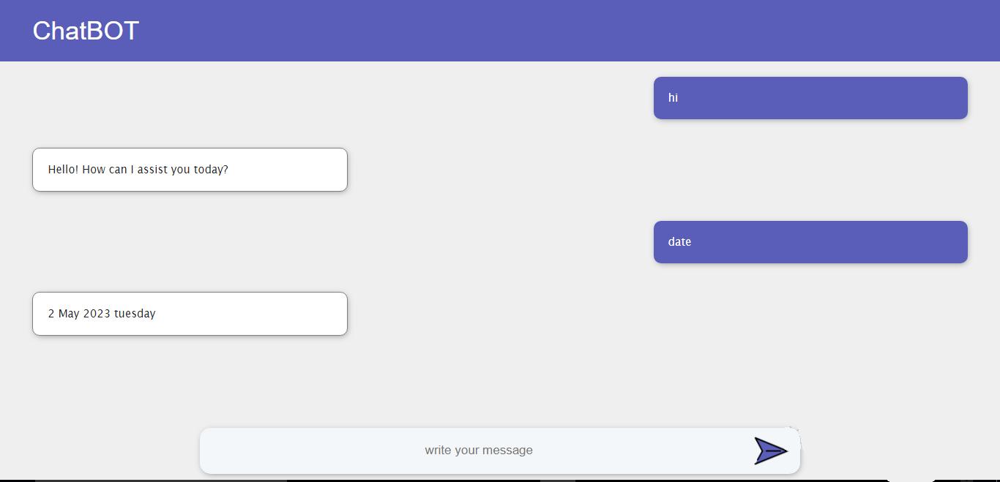

<h1>ChatBOT</h1>

This project is a front-end web-based chatbot that allows users to have conversations with an  bot through a simple web interface. The chatbot is built using HTML, CSS, and JavaScript and runs on a Vite server. The main function of this bot is to interact with the users by replying to their commands  and it can perform mathematical calculations with an execute command and explain certain questions with images.

<h1>Preview</h1>

<h1>Getting Started</h1>

To get started with the chatbot, you'll need to do the following:

<ol>
<li>Clone this repository to your local machine.</li>
<li>Install the required dependencies by running npm install.</li>
<li>Start the Vite server by running 'npm run dev'</li>
<li>Open your web browser and navigate to http://localhost:5173</li>
</ol>
<h1>Customization</h1>

you can customize the chatbot's command by following steps:

<ul>
<li>clone the repo</li>
<li>Add the required command and response at ./command.json file</li>
<li>After customization the bot can respond to the customized commands</li>
<h1>Usage</h1>

To use the chatbot, simply type your message into the input field at the bottom of the chat window and press Enter. The chatbot will then process your message and provide a response.

<h1>Technologies Used</h1>

This chatbot was built using the following technologies:

<ul>
<li>HTML</li>
<li>CSS</li>
<li>JavaScript</li>
<li>Vite</li>
</ul>
